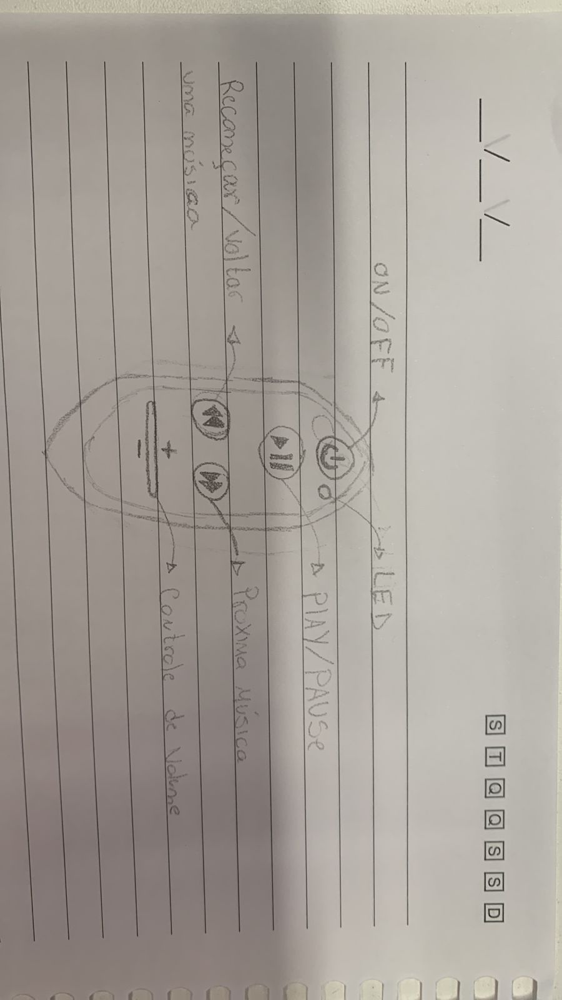

# Projeto Embarcados

Desenvolvendo um controle remoto.

## Entrega 1

### Integrantes

- Ricardo Israel
- Rodrigo Mattar

### Ideia

A ideia é criar um controle que seja aplicavel ao spotify, com botoes de play/pause, passar a musica, recomecar/voltar uma musica e um potenciometro para controlar o volume

### Nome

Controlify

### Usuários 

Todos que ultilizam um aplicativo de streming de musica (spotify).

### Software/Jogo 

Spotify

### Jornada do usuários (3 pts)

(1) - Um usuario  chega em casa e quer ouvir uma musica, ele pega o controle e aperta o play. 
(2) - Um usario precisa falar com alguem, entao ele usa o potenciometro para abaixar o volume da musica. Mesmo assim nao conseguiu prestar atencao entao usa o 
botao de play/pause para pausar a musica.

### Comandos/ Feedbacks (2 pts)
On/Off, Play/Paulse, Passar para proxima Musica, recomecar ou voltar a musica anterior, aumentar/diminir o volume
 
Quais os feedbacks que seu controle vai fornecer ao usuário?
Um led que fica aceso enquanto o controle esta ligado e a cada botao clicado o led pisca

## In/OUT (3 pts)

Para cada Comando/ Feedback do seu controle, associe qual sensores/ atuadores pretende utilizar? Faca em formato de lista, exemplo:

- On/OFF: Push botao amarelo
- Play/Pause: Push botao vermelho
- Avanca música: Push botao verde
- recomeca a musica: Push botao azul
- Voltar uma musica: Push 2 vezes botao azul

### Design (2 pts)

